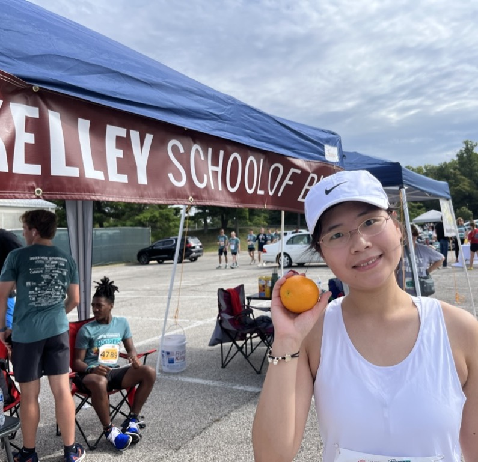
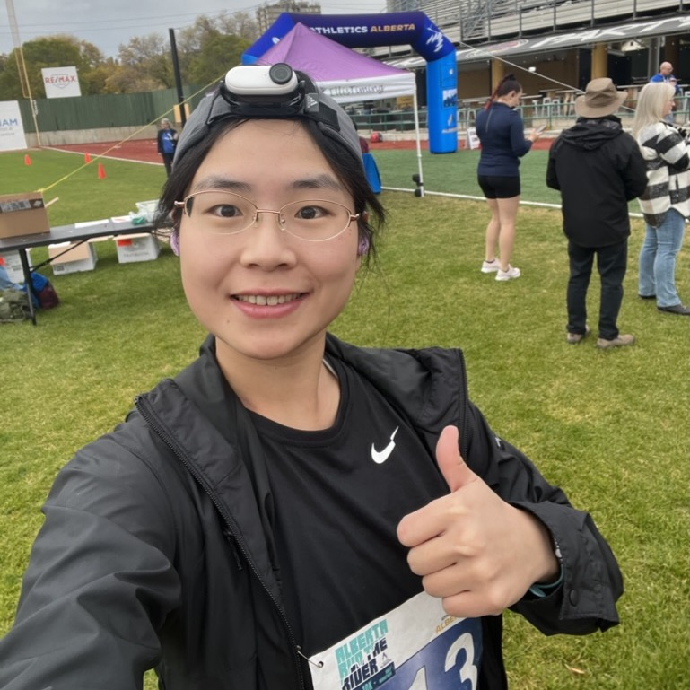

---
---

<link rel="stylesheet" href="https://use.fontawesome.com/releases/v5.0.8/css/solid.css" integrity="sha384-v2Tw72dyUXeU3y4aM2Y0tBJQkGfplr39mxZqlTBDUZAb9BGoC40+rdFCG0m10lXk" crossorigin="anonymous">

Born and raised in Beijing, China, I lived in Shanghai for five years before moving to Bloomington, Indiana in 2019. I got my Bachelor's degree in accounting from [School of Management](https://www.fdsm.fudan.edu.cn/en/), [Fudan University](https://www.fudan.edu.cn/en/). During my time at the University, I participated in the student exchange program and spent a semester at [School of Business](https://www.albany.edu/business) at [University at Albany](https://www.albany.edu/).
In the interim, I have also worked at [Deloitte](https://www2.deloitte.com/cn/en/footerlinks/office-locator/offices-china/shanghai.html) and [McKinsey & Company](https://www.mckinsey.com/locations/mckinsey-client-capabilities-network/shanghai#:~:text=168%20Hubin%20Road,%2B86%20(21)%206386%202000) Shanghai office.

My passion for management scholarship started in the "strategic management" class in my senior year and grew over time. After working as a research assistant for three months at the [Department of Management](https://business.okstate.edu/departments_programs/management/index.html), [Spears Business School](https://business.okstate.edu/), [Oklahoma State University](https://business.okstate.edu/) in the summer of 2018, I decided to pursue a PhD in this field. 

In this video, I talked about my early life experiences and my academic journey up to summer 2018. Get to know me a little by watching this short video that OSU faculty and staff produced for me!

&nbsp;

<iframe width="560" height="315" src="https://www.youtube.com/embed/4hpoNYa2s5g" title="YouTube video player" frameborder="0" allow="accelerometer; autoplay; clipboard-write; encrypted-media; gyroscope; picture-in-picture" allowfullscreen></iframe>

&nbsp;
&nbsp;
&nbsp;

I have always enjoyed swimming and dancing in my spare time. Recently, I picked up running and I am obsessed with it!

<figure>
    
    
    
    
</figure>

Hoosier Half 10k (Bloomington, IN Apr, 2023)Delta Dental 500 5K (Indianapolis, IN May, 2023)Hoosiers Outrun Cancer 2023 5k (Bloomington, IN Sep, 2023)Alberta Run the River 10k (Edmonton, AB Sep, 2023)

<iframe height='300' width='560' frameborder='0' allowtransparency='true' scrolling='no' src='https://www.strava.com/athletes/109393004/activity-summary/a752bee7ddeda1f3d54b07fc7e2a6920a3851fd2'></iframe>
